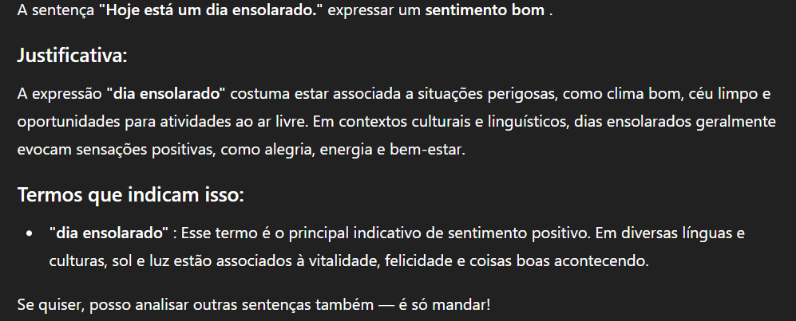
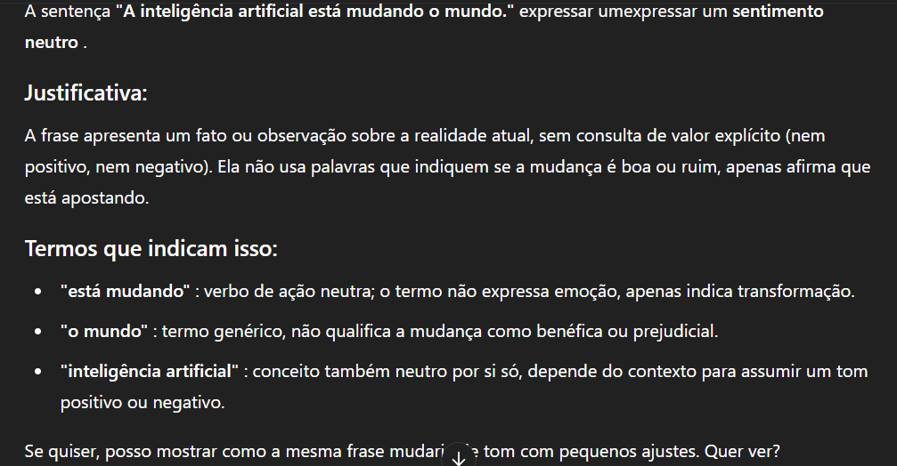

## O que eu fiz

- Criei uma pasta chamada `inputs`
- Adicionei um arquivo com frases
- Usei uma IA para analisar essas frases e trazer insights

## Prints
Frase
Hoje está um dia ensolarado.

A inteligência artificial está mudando o mundo.

## O que aprendi

- A IA consegue identificar padrões nas frases
- Isso pode ser útil em análises de sentimentos, chatbots, e criação de conteúdo
